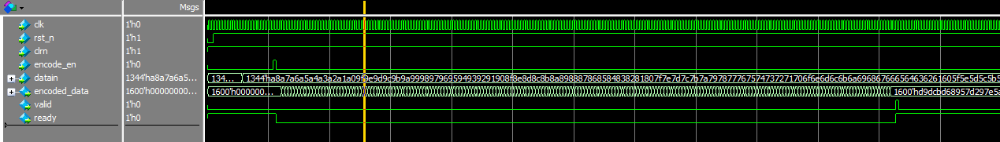
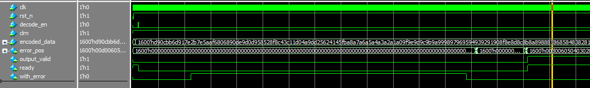

# RS CODE 纠错算法的 RTL实现 基于system verilog 

## 介绍

Erasure Code（EC），即纠删码，是一种前向错误纠正技术（Forward Error Correction，FEC，说明见后附录），主要应用在网络传输中避免包的丢失， 存储系统利用它来提高 存储 可靠性。[算法原理详细介绍](https://blog.csdn.net/shelldon/article/details/54144730) 

### 特性

- 数据并行输入、输出,
- 128-bit 纠错能力,
- 分为编码、解码 两个模块，相互配合工作

### 功能

编码模块输入的 data_in 经过编码，输出encoded_data（为了能够纠错，添加了冗余信息）。encoded_data在传输或者存储中可能有些位置的数据会出错（假设出错后的数据为encoded_data#），将encoded_data#输入解码模块，会输出出错位置error_pos,将encoded_data#与error_pos异或，取前（data_in的位宽）位，就是初始数据data_in。

## 接口

采用简单接口设计，并支持tl_ul总线接口

### rs_encode
| Interface         | direction | width   |
|-|-|-|
|clk|in|1-bit|
|rst_n|in|1-bit|
|clrn|in|1-bit|
|encode_en|in|1-bit|
|data_in|in|1344-bits|
|encoded_data|out|1344-bits|
|valid|out|1-bit|
|ready|out|1-bit|

### rs_decode
| Interface         | direction | width   |
|-|-|-|
|clk|in|1-bit|
|rst_n|in|1-bit|
|clrn|in|1-bit|
|decode_en|in|1-bit|
|encoded_data|in|1600-bits|
|error_pos|out|1600-bits|
|output_valid|out|1-bit|
|ready|out|1-bit|
|with_error|out|1-bit|

## 测试

RS CODE 目前为这两个模块提供了 顶层模块 的基于 **Modelsim** 与 Windows 10 的测试平台

## 运行测试（How to run）

请使用模块文件和testbench基于您自己的验证软件自行构建仿真工程。

#### 波形示例
编码模块

解码模块

